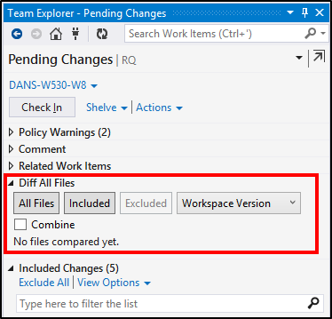
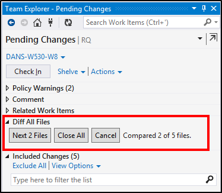
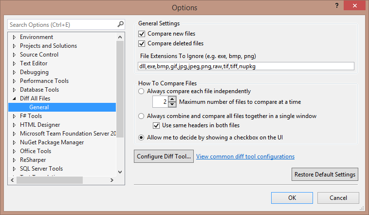

# Description

Quickly and easily compare all files in Git (a commit or Staged/Unstaged files) or TFS (a changeset, shelveset, or files with pending changes) to see what has changed. Instead of clicking on each file individually and choosing to compare it with a different version, just click one button to compare all of the files.

This extension adds a new control into the Team Explorer pane where Visual Studio shows what files have changes. You may edit the extension's settings from the Tools -> Options... -> Diff All Files settings page.

Download this extension for Visual Studio [2012](https://visualstudiogallery.msdn.microsoft.com/a1091118-9765-4554-bc7f-0227028310d5), [2013](https://visualstudiogallery.msdn.microsoft.com/d8d61cc9-6660-41af-b8d0-0f8403b4b39c), or [2015](https://visualstudiogallery.msdn.microsoft.com/e6390f80-c953-4896-bd93-a7dfeba9887b) from the VS Extension Gallery.

# Features

* Compare files one at a time, many files at a time, or with all files combined in a single file.
* Uses the same diff (i.e. compare) tool that you have configured in your .gitconfig (for Git) and Visual Studio (for TFVC). e.g. KDiff, Beyond Compare, Visual Studio, etc.
* Settings to exclude comparing files with specific extensions, or files that have been added or deleted from source control.
* Button to quickly close all diff tool windows that have been opened.
* Remaining files to be compared will open automatically when current file diff windows are closed.
* Specify the file versions to compare against (i.e. Unmodified, Workspace, Previous, Latest).
* Supports both Git and TFVC source control providers.

# Screen shots

Before comparing files (left) and while comparing files (right):

 

Settings Screen (available in Visual Studio from Tools -> Options... -> Diff All Files):

 